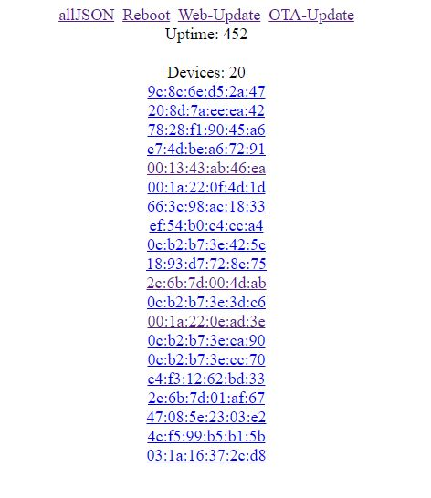
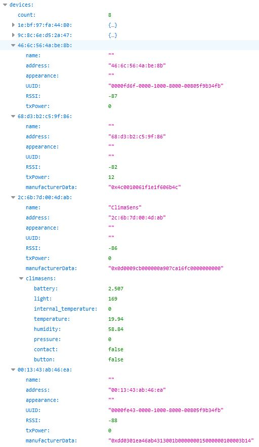

# ESP32-BLE-Gateway

Scans for BLE Broadcasts and provides them on a web interface.
By default the manufacturer data is provided in RAW but can also be parsed like in the example.
All data is parsed into JSON format, so it can be easily accessed by other applications.

I do use this project to read out my own build ClimaSens modules with openHAB.

